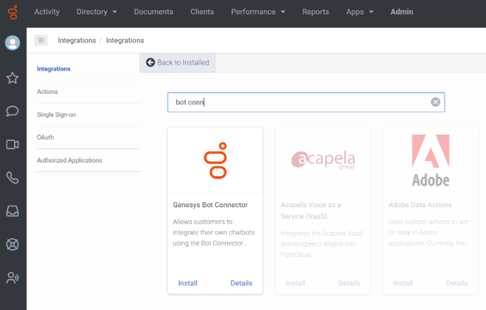
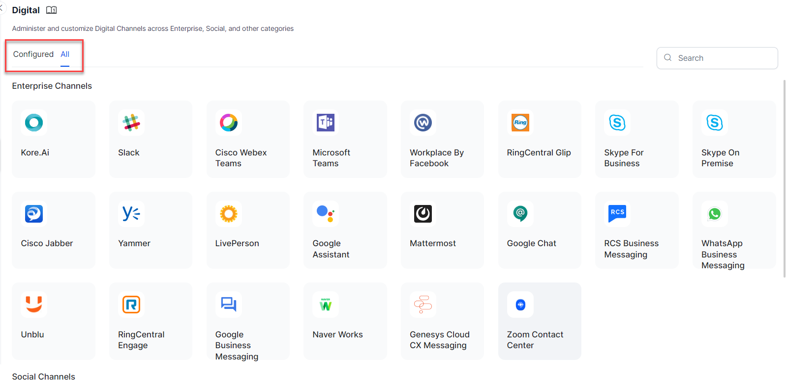
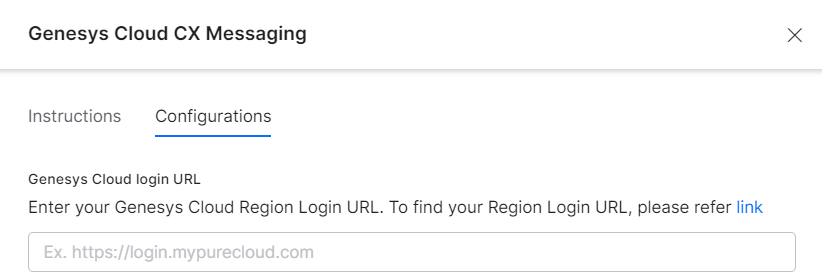
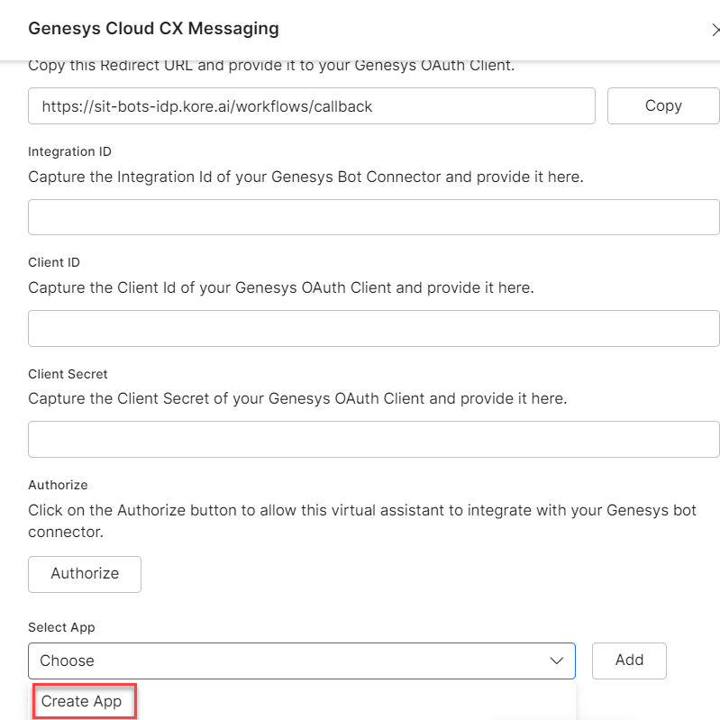
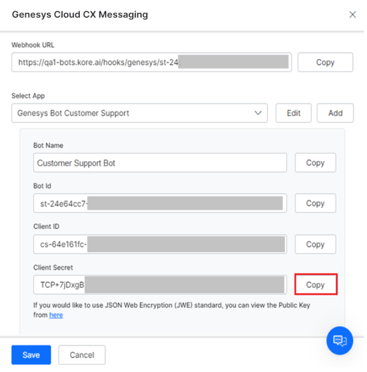
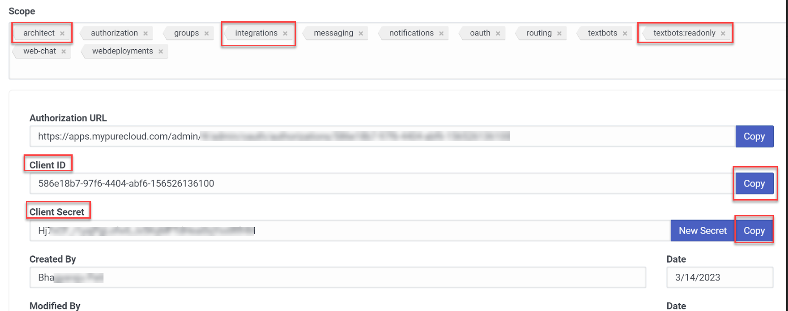
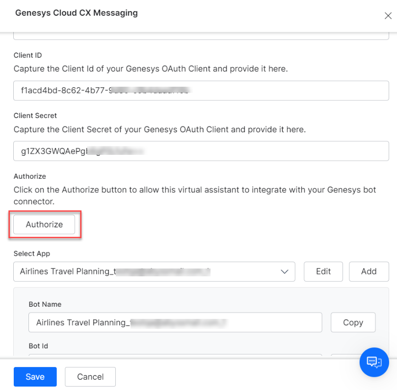

# Adding Genesys Cloud CX Messaging as a Channel

The Kore.ai XO Platform now allows you to add **Genesys Cloud CX Messaging** as a messaging channel for your Virtual Assistants (VAs). Genesys Cloud CX Messaging integration helps instantly share your ideas with people inside your organization with the persistent chat history feature to start a conversation with your colleagues and continue it anywhere, anytime.

!!! note

    This integration works only with Genesys Cloud CX Messaging channel, not the older Genesys web chat.

With the **Genesys Cloud CX Messaging** integration on the Kore.ai XO Platform, you can achieve the following:

* Set up the _REST API_ and authorization flow for events and conversations.
* Link the app to the Kore.ai XO Platform using the app’s credentials.
* Deploy the VAs and transfer conversations to the **Genesys Agent System**.
* Leverage various templates like _Button_, _Quick Replies_, and _Bullets List_ provided by Genesys for message formatting.
* Accept any attachments in the chat messages that Genesys supports.

After the integration, you can do the following:

* Track Virtual Assistant conversations.
* Listen to new messages from Genesys Cloud CX Messaging.
* Have VAs post and respond to messages in Genesys Cloud CX Messaging conversations.
* Have VAs handle incoming notifications from your apps into Genesys Cloud CX Messaging.

To set up **Genesys Cloud CX Messaging** as a channel, use your account on the [Genesys Cloud](https://genesyspartner.force.com/customercare/RequestAccount) Platform and enable a _webhook_ for the platform to receive messages.

The steps to add the channel are summarized below:

1. [Create a Bot Connector](#step-1-create-a-bot-connector) and [Link the Virtual Assistant to the Bot Connector](#step-1-create-a-bot-connector).
2. [Create an App in the Kore.ai Web/Mobile Client](#step-2-create-an-app-on-the-koreai-xo-platform).
3. [Create the OAuth Client App in the Genesys Developer Console](#step-3-create-the-oauth-client-app-on-genesys-developer-console).
4. [Create an inbound message flow](#step-4-create-an-inbound-message-flow).
5. [Configure the Messenger SDK](#step-5-configure-the-messenger-sdk).
6. [Enable the Channel](#step-6-enable-the-channel).
7. [Publish the Bot](#step-7-publish-the-bot).

## Step 1: Create a Bot Connector

A **Bot Connector integration** enables your bot to exchange messages with the _Genesys Agent System_ configured on the Kore.ai XO Platform by using industry-standard _REST_ and _JSON_ over HTTPS.

1. Log in to the **[Genesys Developer Portal](https://login.mypurecloud.com/)**.
2. Create a Bot Connector with the steps below:
3. **On the Genesys Cloud CX Admin portal**
    1. In the Genesys Cloud Admin portal, navigate to **Admin** > **Integrations**.
    2. Use the **+ Integrations** button to find integration options.
    3. Search for “bot connector” and find the **Genesys Bot Connector**. Install it to your instance.
    
4. **On the Kore.ai XO Platform**
    1. On the Kore.ai XO Platform, navigate to **Channels & Flows** > **Channels** > **Digital** > **All** > **Genesys Cloud CX Messaging**.
    
    2. Copy the **Webhook URL** from the **Configurations** section of the Kore.ai XO Platform for the Genesys Cloud CX Messaging Channel screen.
    
5. **On the Genesys Cloud CX Admin portal**
    1. Go back to the Genesys Admin portal. In the **Properties** section under **Configuration** for the Bot Connector, paste the webhook in the **Value** field for **Bot Connector Handle Utterance URI**.
    
    2. Leave this page open for additional configuration.
6. **On the Kore.ai XO Platform**
    1. In the **Genesys Cloud login URL** field under **Configuration**, provide the URL of your Genesys AWS Region, which will allow the platform to route the conversation requests correctly. This is a **mandatory field.** You can find the URL of your region through the link provided in the field description on the screen.
    
    2. Leave the **Genesys Cloud CX Messaging** channel configuration open for further configuration.

## Step 2: Create an App on the Kore.ai XO Platform

Create an app on the Kore.ai XO platform. A JWT Token is created with the **clientId** and **clientSecret** credentials. For more information, read[ Adding the Web/Mobile Client Channel](https://developer.kore.ai/docs/bots/channel-enablement/adding-the-webmobile-client-channel/) article.

1. Click the **Create App** link under the **Configurations** section of the **Genesys Cloud CX Messaging** Channel. 

    

2. Use the **_Client ID_** and **_Client Secret_** value of the new app to create a JWT token using the steps mentioned[ here](https://developer.kore.ai/docs/bots/channel-enablement/adding-the-webmobile-client-channel/).

    

3. Navigate back to the **Bot Connector** configuration screen in the Genesys Cloud Admin portal.
4. Navigate to the **Configuration** > **Credentials** section and click **Change**.
5. Create a new **Field Name** called **Authorization**.
6. Paste the following in the **Value** field on the **Change Credentials** window.
    1. The word **bearer**
    2. A space
    3. The **JWT** created in before. 

        

7. Click **Ok**.

!!! note

    Select HS256 for JWT Signing Algorithms Used For Client App Authentication.

## Step 3: Create the OAuth Client App on Genesys Developer Console 

Steps to create an app on the Genesys Developer Console:

1. Log in to the[ Genesys Developer Portal](https://login.mypurecloud.com/#/authenticate).

2. Navigate to **Admin > Integrations > OAuth**.

3. Click **Add Client** on the OAuth Screen.

4. Enter the **App Name** and **Description**.

5. Select the **Grant Types** as _Code Authorization_.
    

6. Copy the **Callback URL** from the **Configurations** tab of the Kore.ai XO Platform for Genesys Cloud CX Messaging channel.
    

7. In the Genesys Console, go back to the **Integrations > OAuth** page and paste the **Callback URL** that you have copied in the **Authorized redirect URI** field.

8. Add the _architect_, _integrations_, and _textbot_ scopes in the **Scopes** field.
    

9. Click **Save** to update the OAuth Client configuration.

10. Copy the **Client ID** and **Client Secret** from the OAuth Client App page.

11. In the Kore.ai XO Platform, return to the **Channels & Flows** > **Channels** > **Digital** > **All** > **Genesys Cloud CX Messaging** > **Configurations** tab and paste the **Client ID** and **Client Secret** values.

12. Once you paste all the required credentials, click **Authorize** to validate the authorization.
    

13. If you are still logged into your Genesys Cloud instance, your current credentials are used. Otherwise, a login screen will open. Use valid credentials for the Genesys cloud instance you are configuring.

Your Bot Connector is created successfully!

## Step 4: Create an Inbound Message Flow

To create an inbound message flow after connecting your VA to the Bot Connector, follow the steps below:

1. Navigate to **Admin** > **Architect** on the **Genesys Bot Connector** page.
2. Click the **Flows: Inbound Message** tab.
3. Click the Add button.
4. In the **Create ‘Inbound Message Flow’** window, enter the values for the required fields.
5. Click **Create Flow**.

6. After creating the Inbound Message Flow, follow the steps below:
    * Click the flow you’ve created in the list.
    * Click the **Initial State** icon on the top menu.
    * Select the **Call Bot Connector** option by navigating to **Start** > **Toolbox** > **Bot**.
    
    * Select the bot connector and the relevant Bot from the list.
    * Enter values for the given fields.
    

7. Click **Publish** on the top panel.

## Step 5: Configure the Messenger SDK

After creating the inbound messaging flow, you should configure and deploy the messenger with the steps below:

  1. In the Genesys Cloud CX Admin portal, navigate to **Admin** > **Message** > **Messenger Deployments**.
  2. Enter the values for **Name** and **Description**.
  3. Set **Status** to _Active_.
  4. For **Select your Configuration**, select the _Messenger Configuration_ to assign it to the deployment.
  5. For **Restrict Domain Access**, select _Allow all domains_.
  6. For **Select your Architect Flow**, select your Message Flow created in the previous step.
  7. Click **Save**.
  The system routes the message sent by the user via the **Genesys Messenger** to the message flow.
  

  8. Paste the script generated in the messenger deployment on the HTML page where you want to add the **Genesys Messenger**.
  

## Step 6: Enable the Channel

After you’ve configured the Genesys Messenger and deployed it for your Virtual Assistant, you must enable the **Genesys Cloud CX Messaging** Channel by following the steps below:

1. Navigate to **Channels & Flows** > **Channels** > **Digital** > **All** > **Genesys Cloud CX Messaging** on the Kore.ai XO Platform.
2. Click the **Configurations** tab.
3. Select _YES_ for **Enable Channel**.
4. Click **Save**.

## Step 7: Publish the Bot

After enabling the channel and verifying all the configurations, you can optionally publish the assistant for the new channel. Learn more about[ Publishing your Virtual Assistant](../deploy/publishing-bot.md).

To learn more about working with Channels within the Kore.ai XO Platform, please see [Channel Enablement.](../channels/adding-channels-to-your-bot.md)

